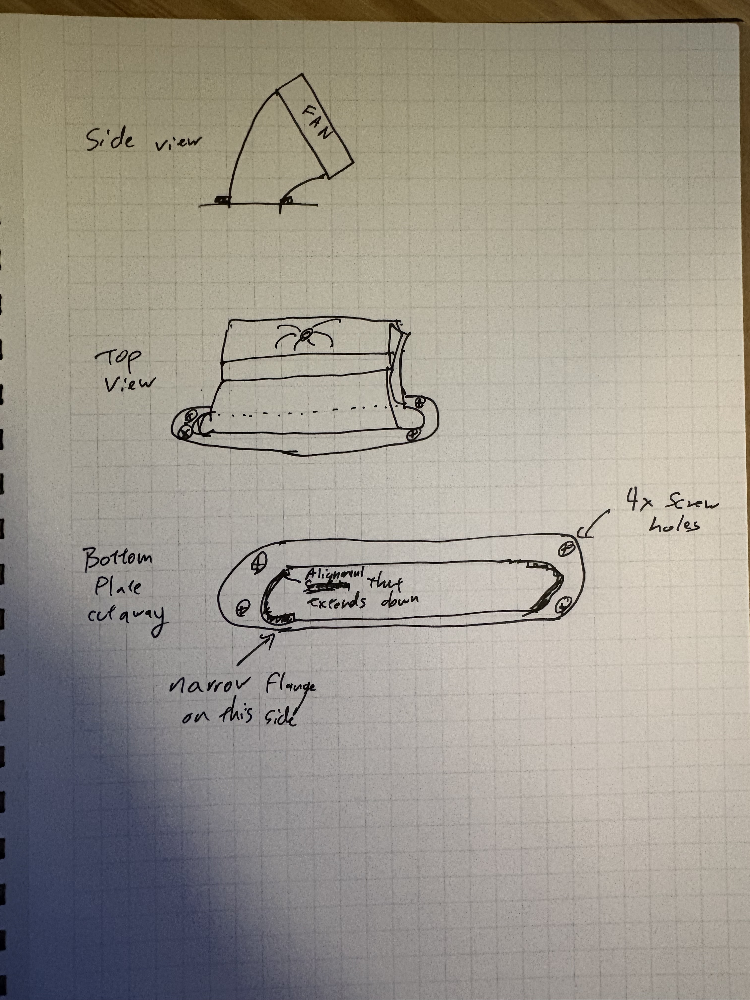
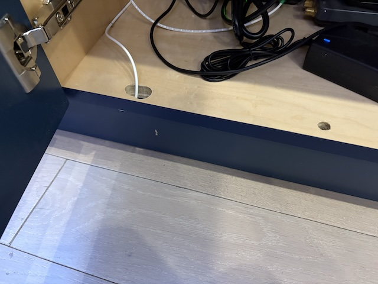
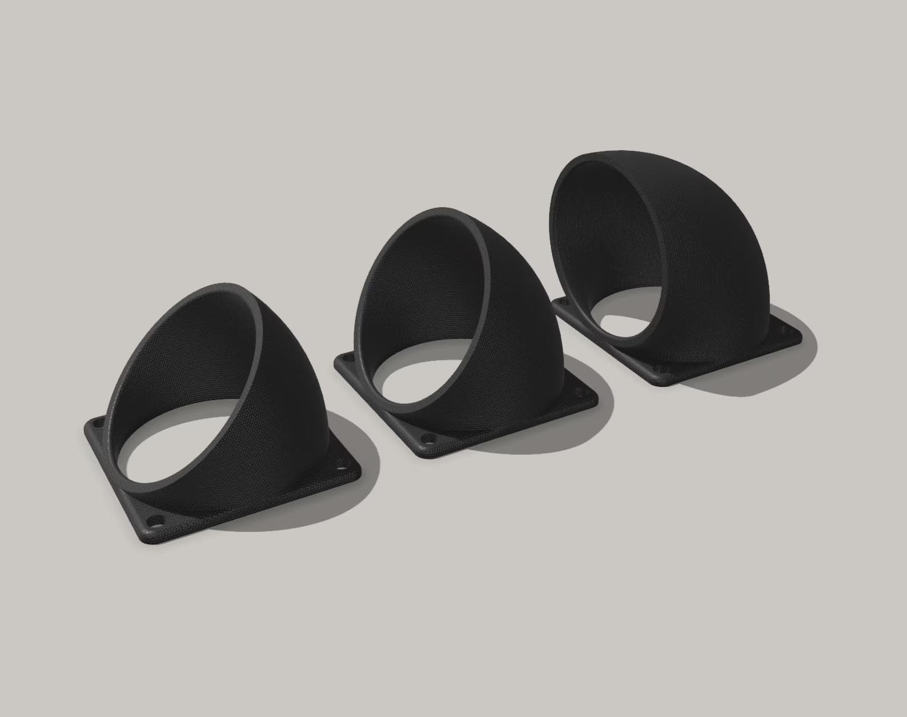

# Intake Fan Adapter Design Instructions

## Purpose
Create a scoop fan adapter that connects smaller fans (80mm, but configurable to 60mm) to intake slots cut into the bottom of a media console cabinet to improve airflow. The adapter & fan will be mounted inside the cabinet, drawing air from slots in the cabinet overhang above the toekick area. 

The adapter will be designed to fit the fan snugly against the cabinet floor, holding it at an angle. It should have an airflow efficient sloped transition from the intake slot to the fan (or two fans?).

## Images
 - this is a terrible sketch of the design.

 - this is a photo of the cabinet bottom front where the adapter will be installed. The fan will be mounted inside the cabinet, and the adapter will connect to an enlarged slot cut into the bottom of the cabinet where the current small holes are drilled.

 - this is a photo of a slightly similar fan adapter design. Our design needs to be more compact and have an elongated "stadium"/"pill" shaped intake slot to match the narrow cabinet toekick overhang.

## Design Requirements

### Intake Slot Configuration
- Overall a "stadium" or "pill" shaped slot
- Slot width: 3/4 inch (19.05mm). I'm going to drill out with a 3/4" drill bit on each end, then I'll connect the two holes with a jigsaw
- Slot length: TBD, probably wider than the fan itself
- A flange is necessary, and will have screw holes to mount the adapter to the cabinet. However, due to the narrow width of the overhang we have to work with, on the non-fan side it should be very small, just 1/16" or so?

### Fan Specifications
We may want to change the fan size in the future, so make it configurable. For now, we will use an 80mm fan, but we may want to change to a 60mm fan in the future.

- Fan size options: 80mm Noctua PC fan
- 80mm fan inner diameter: ~76mm
- Fan mounting hole spacing:
  - 80mm fan: 71.5mm (between mounting holes)

### Adapter Features
- External mounting flange with 4 screw wood holes for attaching to cabinet bottom
- Smooth transition from stadium slot to round fan opening
- Compact design
- Tilt (45° ?) into the cabinet for better airflow
- Wall thickness: 2mm for structural integrity while remaining lightweight

### Mounting Hardware
- Fan side: M4 heat-set nuts (6mm hole diameter, 5mm depth)
- Cabinet side: #8 wood screws (4.16mm shaft diameter, 8.33mm head diameter)
- Countersink screw holes on cabinet side to ensure flush mounting
- Ensure proper screw placement on external flange (corners)

### Airflow Considerations
- Design for minimal airflow restriction
- Smooth, gradual transition from slot to round opening
- Round interior corners to reduce turbulence
- Maintain adequate internal volume for proper airflow

### Manufacturing Considerations
- Design for 3D printing (minimal supports if possible)
- Minimum wall thickness of 2.5mm for structural stability
- Use $fn=100 for smooth curved surfaces on the final version, but lower for faster iterations early on
- Ensure all dimensions are precise for proper fan fit

## OpenSCAD Implementation Notes
- Use BOSL2 library for advanced features
- Create parametric design for easy modification
- Include options for both 80mm and 60mm fans
- Implement modular design with clear function separation
- Use hull() approach for smooth transitions between shapes
- Provide visual renders from multiple angles for verification
- At the very end after confirming it's good we will increase resolution and generate STL files for direct 3D printing

## Design Process
- Start with a basic shape and gradually refine it
- Git version control for all design iterations
- Use a simple Makefile to automate the rendering process
- Document each version with notes on changes made
- Use comments in OpenSCAD code to explain design choices and parameters
- Test each version VERY THOROUGHLY by rendering and checking for errors. You'll need to render multiple views to verify design before considering a version done. Rendering the design from multiple angles will help you identify any potential issues with the design before printing, such as incorrect dimensions, misalignments, impossible to 3D print shapes, poor airflow, and other problems. This is especially important for complex designs with multiple components or features.
- I expect you'll need to iterate on each major version a few times before it's ready for my review

## Validation
- Render multiple views to verify design before considering a version done
- Check for geometric errors or inconsistencies, such as overlapping shapes or extra gaps
- Check clearances for all mounting hardware
- Ensure smooth internal airflow path
- Verify that the design meets all specifications above
- Once verified, generate both render images and printable STL files